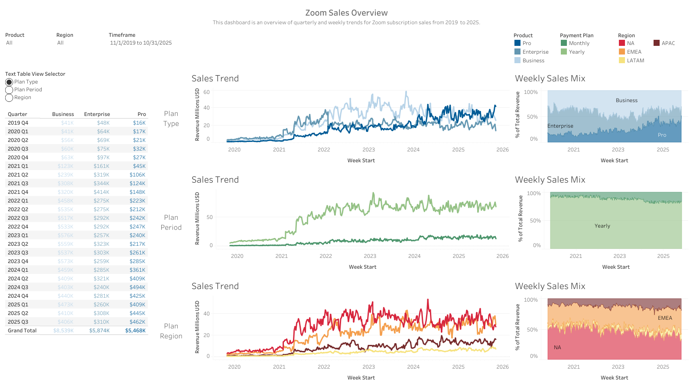

# Zoom Subscriptions Analysis (2019 - 2025)

Analyzing Zoom subscription trends from 2019 Q4 to 2025 Q3.  
Interactive Tableau dashboard can be found [**here**](https://public.tableau.com/views/ZoomRevenueProject/Dashboard1?:language=en-US&publish=yes&:sid=&:redirect=auth&:display_count=n&:origin=viz_share_link).

---

## North Star Metrics and Dimensions

- **Sales**: Total subscription sales from Pro, Business, and Enterprise plans  
- **Plan type**: Business, Enterprise, or Pro  
- **Plan period**: Yearly or Monthly plans  
- **Plan region**: Asia Pacific (APAC), North America (NA), Latin America (LATAM), Europe, Middle East, Africa (EMEA)  

---

## Summary of Insights

### Overall Trends
- Substantial revenue growth was observed in 2021, largely driven by Enterprise plans during the early COVID-19 surge.

### Plan Type
- **Enterprise** plans experienced a dramatic spike during the early months of the COVID-19 pandemic, peaking at **$226K** in weekly bookings, but this surge faded by mid-2021 and has not rebounded.
- **Business** plans showed steady growth through 2022 and early 2023 but experienced a sharp decline at the end of 2023 and into 2024, raising concerns about customer retention or new competition.
- **Pro** plans demonstrated consistent, modest growth and are now outperforming Business plans in certain quarters, suggesting a shift in market demand toward smaller or individual account holders.

### Plan Period
- **Yearly subscriptions** account for over **90%** of total revenue across all regions but have exhibited a steady decline, indicating potential changes in customer commitment behavior or market conditions.

### Plan Region
- **North America (NA)**: Displays seasonal dips but overall consistent growth in Pro plan revenue over five years. Pro revenue now matches that of Business and Enterprise.
- **Latin America (LATAM)**: Historically dominated by Business plans, but a steep decline in Business subscriptions has been offset by a sharp increase in Pro plan adoption.
- **Asia Pacific (APAC)**: Enterprise plan revenue remained low and stagnant early on but has recently grown significantly, with all three plans now competing closely in total revenue generation.
- **Europe, Middle East, Africa (EMEA)**: Business plan performance is declining, while Pro plan revenue has increased steadily, indicating a changing customer preference.

---

## Recommendations & Next Steps

- Investigate the recurring summer drop-off in Enterprise plan bookings and determine whether it's tied to seasonality, product limitations, or external market conditions.
- Explore whether product features, marketing adjustments, or pricing incentives could stabilize or enhance Enterprise and Business plan performance across key regions.

---

## Improvements to Project
- Incorporate SQL to demonstrate proficiency in writing queries and create a more realistic workflow by extracting data from a database.
